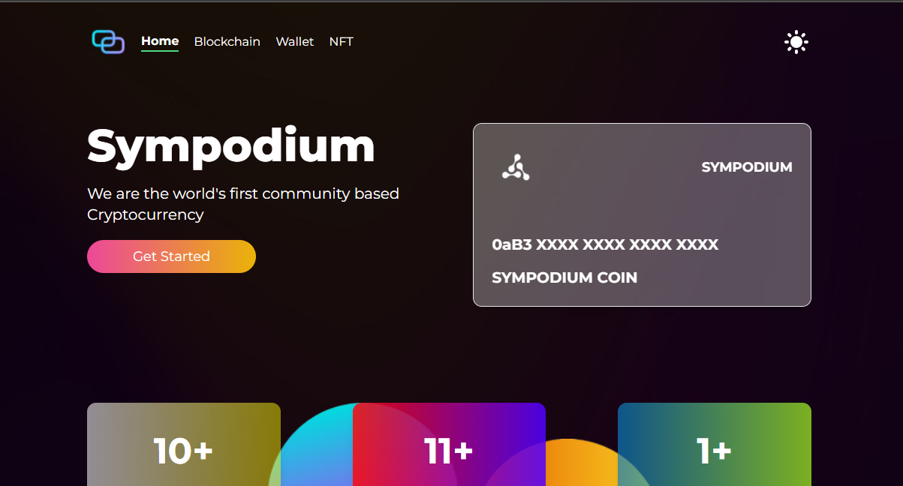

<!-- PROJECT LOGO -->
<br />
<div align="center">
  <a href="https://github.com/othneildrew/Best-README-Template">
    
  </a>

  <h3 align="center">Sympodium Coin</h3>

  <p align="center">
   A Core blockchain application 
    <br />
    <a href="https://github.com/othneildrew/Best-README-Template"><strong>Explore the docs »</strong></a>
    <br />
    <br />
    <a href="https://sympodium.netlify.app">View App</a>
    
  </p>
</div>

<!-- TABLE OF CONTENTS -->
<details>
  <summary>Table of Contents</summary>
  <ol>
    <li>
      <a href="#about-the-project">About The Project</a>
      <ul>
        <li><a href="#built-with">Built With</a></li>
      </ul>
    </li>
    <li>
      <a href="#getting-started">Getting Started</a>
      <ul>
        <li><a href="#prerequisites">Prerequisites</a></li>
        <li><a href="#installation">Installation</a></li>
      </ul>
    </li>
    <li><a href="#contributing">Contributing</a></li>
    <li><a href="#license">License</a></li>
    <li><a href="#contact">Contact</a></li>
    <li><a href="#acknowledgments">Acknowledgments</a></li>
  </ol>
</details>

<!-- ABOUT THE PROJECT -->

## About The Project



Making use of blockchain technology, we have created the first
community based cryptocurrency called Sympodium coin. Which exist
outside central authority and it is fully peer to peer. We have an NFT
market place called Sympodium NFT That allows user to mint NFT'S

### Built With

This section should list any major frameworks/libraries used to bootstrap your project. Leave any add-ons/plugins for the acknowledgements section. Here are a few examples.

- [Next.js](https://nextjs.org/)
- [React.js](https://reactjs.org/)
- [TailwindCSS.js](https://tailwindcss.com/)
- [Solidity.js](https://docs.soliditylang.org/)
- [Typescript.js](https://www.typescriptlang.org/)
- [Express.js](https://expressjs.com/)

<!-- GETTING STARTED -->

## Getting Started

The project consist of the backend and also the front end.

### Prerequisites

- nodejs installed

- npm
  ```sh
  npm install npm@latest -g
  ```

### Local setup

To run this project locally, follow these steps.

1. Clone the project locally, change into the directory, and install the dependencies:

```sh
git clone https://github.com/mendsalbert/hyadum_coin_frontend

cd hyadum_coin_frontend

# install using NPM or Yarn
npm install

# or

yarn
```

2. Start the local Hardhat node

```sh
npx hardhat node
```

3. With the network running, deploy the contracts to the local network in a separate terminal window

```sh
npx hardhat run scripts/deploy.js --network localhost
```

4. Start the app

```
npm run dev
```

### Configuration

To deploy to Polygon test or main networks, update the configurations located in **hardhat.config.js** to use a private key and, optionally, deploy to a private RPC like Infura.

```javascript
require("@nomiclabs/hardhat-waffle");
const fs = require("fs");
const privateKey =
  fs.readFileSync(".secret").toString().trim() || "01234567890123456789";

// infuraId is optional if you are using Infura RPC
const infuraId = fs.readFileSync(".infuraid").toString().trim() || "";

module.exports = {
  defaultNetwork: "hardhat",
  networks: {
    hardhat: {
      chainId: 1337,
    },
    mumbai: {
      // Infura
      // url: `https://polygon-mumbai.infura.io/v3/${infuraId}`
      url: "https://rpc-mumbai.matic.today",
      accounts: [privateKey],
    },
    matic: {
      // Infura
      // url: `https://polygon-mainnet.infura.io/v3/${infuraId}`,
      url: "https://rpc-mainnet.maticvigil.com",
      accounts: [privateKey],
    },
  },
  solidity: {
    version: "0.8.4",
    settings: {
      optimizer: {
        enabled: true,
        runs: 200,
      },
    },
  },
};
```

If using Infura, update **.infuraid** with your [Infura](https://infura.io/) project ID.

<!-- USAGE EXAMPLES -->

<!-- ROADMAP -->

<p align="right">(<a href="#top">back to top</a>)</p>

<!-- CONTRIBUTING -->

## Contributing

Contributions are what make the open source community such an amazing place to learn, inspire, and create. Any contributions you make are **greatly appreciated**.

If you have a suggestion that would make this better, please fork the repo and create a pull request. You can also simply open an issue with the tag "enhancement".
Don't forget to give the project a star! Thanks again!

1. Fork the Project
2. Create your Feature Branch (`git checkout -b feature/AmazingFeature`)
3. Commit your Changes (`git commit -m 'Add some AmazingFeature'`)
4. Push to the Branch (`git push origin feature/AmazingFeature`)
5. Open a Pull Request

<!-- LICENSE -->

## License

Distributed under the MIT License. See `LICENSE.txt` for more information.

<p align="right">(<a href="#top">back to top</a>)</p>

<!-- CONTACT -->

## Contact

Your Name - [@your_twitter](https://twitter.com/your_username) - email@example.com

Project Link: [https://github.com/your_username/repo_name](https://github.com/your_username/repo_name)

<p align="right">(<a href="#top">back to top</a>)</p>

<!-- ACKNOWLEDGMENTS -->

## Acknowledgments

Use this space to list resources you find helpful and would like to give credit to. I've included a few of my favorites to kick things off!

- [Choose an Open Source License](https://choosealicense.com)
- [GitHub Emoji Cheat Sheet](https://www.webpagefx.com/tools/emoji-cheat-sheet)
- [Malven's Flexbox Cheatsheet](https://flexbox.malven.co/)
- [Malven's Grid Cheatsheet](https://grid.malven.co/)
- [Img Shields](https://shields.io)
- [GitHub Pages](https://pages.github.com)
- [Font Awesome](https://fontawesome.com)
- [React Icons](https://react-icons.github.io/react-icons/search)

<p align="right">(<a href="#top">back to top</a>)</p>

<!-- MARKDOWN LINKS & IMAGES -->
<!-- https://www.markdownguide.org/basic-syntax/#reference-style-links -->

[contributors-shield]: https://img.shields.io/github/contributors/othneildrew/Best-README-Template.svg?style=for-the-badge
[contributors-url]: https://github.com/othneildrew/Best-README-Template/graphs/contributors
[forks-shield]: https://img.shields.io/github/forks/othneildrew/Best-README-Template.svg?style=for-the-badge
[forks-url]: https://github.com/othneildrew/Best-README-Template/network/members
[stars-shield]: https://img.shields.io/github/stars/othneildrew/Best-README-Template.svg?style=for-the-badge
[stars-url]: https://github.com/othneildrew/Best-README-Template/stargazers
[issues-shield]: https://img.shields.io/github/issues/othneildrew/Best-README-Template.svg?style=for-the-badge
[issues-url]: https://github.com/othneildrew/Best-README-Template/issues
[license-shield]: https://img.shields.io/github/license/othneildrew/Best-README-Template.svg?style=for-the-badge
[license-url]: https://github.com/othneildrew/Best-README-Template/blob/master/LICENSE.txt
[linkedin-shield]: https://img.shields.io/badge/-LinkedIn-black.svg?style=for-the-badge&logo=linkedin&colorB=555
[linkedin-url]: https://linkedin.com/in/othneildrew
[product-screenshot]: images/screenshot.png
